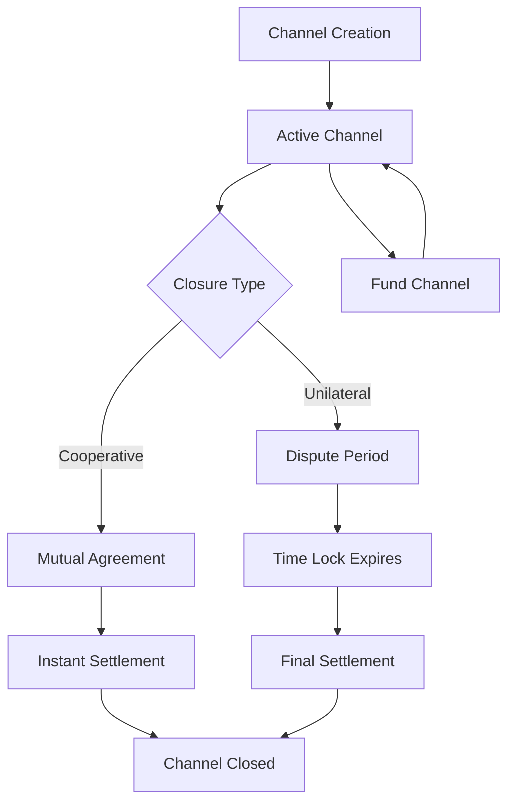

# StreamBridge - Advanced Bidirectional Payment Channels

[](https://opensource.org/licenses/MIT)
[](https://stacks.co)
[](https://clarity-lang.org)

A revolutionary trustless payment infrastructure enabling instant, cost-effective microtransactions through sophisticated state channel technology. StreamBridge eliminates blockchain congestion by moving frequent payments off-chain while maintaining cryptographic security guarantees.

## 🚀 Key Features

- **Lightning-fast Off-chain Payments** - Instant transactions between any two parties
- **Zero-fee Microtransactions** - Unlimited transaction throughput without gas fees
- **Cryptographic Security** - Battle-tested dispute resolution with economic incentives
- **Flexible Channel Management** - Cooperative and forced exit mechanisms
- **Comprehensive Safety** - Input sanitization and emergency recovery systems
- **Transparent State** - Complete channel visibility for external systems

## 🏗️ System Overview

StreamBridge implements bidirectional payment channels that allow two parties to conduct unlimited off-chain transactions while only requiring on-chain settlement for channel opening and closing. This dramatically reduces transaction costs and increases throughput.

### Architecture Diagram

```
┌─────────────────────────────────────────────────────────────────┐
│                     StreamBridge Architecture                   │
├─────────────────────────────────────────────────────────────────┤
│                                                                 │
│  ┌─────────────┐    Off-chain Payments    ┌─────────────┐      │
│  │ Participant │ ◄──────────────────────► │ Participant │      │
│  │      A      │                          │      B      │      │
│  └─────────────┘                          └─────────────┘      │
│         │                                          │            │
│         │              On-chain Events             │            │
│         ▼                                          ▼            │
│  ┌─────────────────────────────────────────────────────────────┐ │
│  │                StreamBridge Contract                       │ │
│  │  ┌─────────────┐ ┌─────────────┐ ┌─────────────────────┐   │ │
│  │  │   Channel   │ │  Dispute    │ │   Emergency         │   │ │
│  │  │ Management  │ │ Resolution  │ │   Recovery          │   │ │
│  │  └─────────────┘ └─────────────┘ └─────────────────────┘   │ │
│  │                                                             │ │
│  │  ┌─────────────────────────────────────────────────────┐   │ │
│  │  │              Payment Channels Map                   │   │ │
│  │  │  Key: {channel-id, participant-a, participant-b}   │   │ │
│  │  │  Value: {balances, state, dispute-info}            │   │ │
│  │  └─────────────────────────────────────────────────────┘   │ │
│  └─────────────────────────────────────────────────────────────┘ │
│                              │                                   │
│                              ▼                                   │
│                    ┌─────────────────┐                          │
│                    │  Stacks Network │                          │
│                    │   (Settlement)  │                          │
│                    └─────────────────┘                          │
└─────────────────────────────────────────────────────────────────┘
```

## 🔧 Contract Architecture

### Core Components

#### 1. **Channel Management**

- `create-channel` - Establishes new payment channels with initial funding
- `fund-channel` - Adds liquidity to existing channels
- `get-channel-info` - Retrieves channel state and balance information

#### 2. **Cooperative Closure**

- `close-channel-cooperative` - Instant settlement with mutual consent
- Requires cryptographic signatures from both participants
- Immediate fund distribution upon successful verification

#### 3. **Dispute Resolution**

- `initiate-unilateral-close` - Starts forced closure with time-lock
- `resolve-unilateral-close` - Finalizes closure after dispute period
- 1-week dispute window (1008 blocks) for challenge submissions

#### 4. **Security Layer**

- Input validation for all parameters
- Cryptographic signature verification
- Emergency recovery mechanisms for contract owner

### Data Structures

```clarity
payment-channels: {
  key: {
    channel-id: (buff 32),
    participant-a: principal,
    participant-b: principal
  },
  value: {
    total-deposited: uint,
    balance-a: uint,
    balance-b: uint,
    is-open: bool,
    dispute-deadline: uint,
    nonce: uint
  }
}
```

## 📊 Data Flow

### Channel Lifecycle



### Transaction Flow

1. **Channel Opening**
   - Participant A calls `create-channel` with initial deposit
   - Funds locked in contract escrow
   - Channel state initialized and marked as open

2. **Off-chain Payments**
   - Parties exchange signed state updates off-chain
   - No blockchain interaction required
   - Unlimited transaction frequency

3. **Channel Closure**
   - **Cooperative**: Both parties sign final state and close instantly
   - **Unilateral**: One party initiates closure with dispute period
   - Final balances distributed according to last valid state

## 🛠️ Installation & Setup

### Prerequisites

- [Clarinet](https://github.com/hirosystems/clarinet) CLI tool
- Node.js 16+ for testing framework
- Git for version control

### Installation

```bash
# Clone the repository
git clone https://github.com/itohowo-dot/stream-bridge.git
cd stream-bridge

# Install dependencies
npm install

# Run contract checks
clarinet check

# Execute test suite
npm test
```

## 🧪 Testing

The project includes comprehensive test coverage for all contract functions:

```bash
# Run all tests
npm test

# Check contract syntax
clarinet check

# Run specific test file
npm test stream-bridge.test.ts
```

## 📖 Usage Examples

### Creating a Payment Channel

```clarity
;; Create a channel with 1000 STX initial deposit
(contract-call? .stream-bridge create-channel 
  0x1234567890abcdef1234567890abcdef12345678 ;; channel-id
  'SP2J6ZY48GV1EZ5V2V5RB9MP66SW86PYKKNRV9EJ7  ;; participant-b
  u1000000000                                   ;; 1000 STX in microSTX
)
```

### Cooperative Channel Closure

```clarity
;; Close channel with mutual consent
(contract-call? .stream-bridge close-channel-cooperative
  0x1234567890abcdef1234567890abcdef12345678 ;; channel-id
  'SP2J6ZY48GV1EZ5V2V5RB9MP66SW86PYKKNRV9EJ7  ;; participant-b
  u600000000                                   ;; final balance A
  u400000000                                   ;; final balance B
  0x1234...5678                               ;; signature A
  0xabcd...ef90                               ;; signature B
)
```

### Funding an Existing Channel

```clarity
;; Add 500 STX to existing channel
(contract-call? .stream-bridge fund-channel
  0x1234567890abcdef1234567890abcdef12345678 ;; channel-id
  'SP2J6ZY48GV1EZ5V2V5RB9MP66SW86PYKKNRV9EJ7  ;; participant-b
  u500000000                                   ;; additional funds
)
```

## 🔒 Security Considerations

### Input Validation

- All inputs undergo comprehensive validation
- Channel IDs must be valid 32-byte buffers
- Signatures must be exactly 65 bytes
- Deposit amounts must be positive

### Cryptographic Security

- Signature verification for all state transitions
- Secure message construction for signature validation
- Protection against replay attacks through nonces

### Economic Security

- Dispute periods provide fraud protection
- Time-locked settlements ensure fair resolution
- Conservation of funds principle enforced

### Emergency Mechanisms

- Contract owner emergency withdrawal capability
- Designed for catastrophic failure scenarios only
- Requires explicit owner authorization

## 🎯 Use Cases

StreamBridge enables revolutionary applications across multiple domains:

### **Content Streaming**

- Per-second billing for video/audio content
- Real-time micropayments for premium features
- Instant monetization for content creators

### **IoT Micropayments**

- Machine-to-machine payment systems
- Pay-per-use device interactions
- Automated resource billing

### **Gaming Economies**

- In-game asset transfers
- Tournament prize distributions
- Real-time betting and rewards

### **Financial Services**

- High-frequency trading settlements
- Peer-to-peer lending platforms
- Automated recurring payments

## 🚧 Roadmap

- [ ] **v1.1** - Multi-party channel support
- [ ] **v1.2** - Channel routing and payment forwarding
- [ ] **v1.3** - Advanced dispute resolution mechanisms
- [ ] **v2.0** - Cross-chain compatibility
- [ ] **v2.1** - Automated market makers integration

## 🤝 Contributing

We welcome contributions from the community! Please see our [Contributing Guidelines](CONTRIBUTING.md) for details on:

- Code style and standards
- Pull request process
- Issue reporting
- Security vulnerability disclosure

## 📄 License

This project is licensed under the MIT License - see the [LICENSE](LICENSE) file for details.

## WalletConnect Integration

Quick steps to install WalletConnect WalletKit and run the wallet helper included in `src/`:

1. Install packages:

```bash
npm install @reown/walletkit @walletconnect/utils @walletconnect/core
```

2. Initialize the WalletKit helper (example):

```bash
# set a WalletConnect project id then run
export PROJECT_ID=your_project_id
node --loader ts-node/esm src/main.ts
```

Files added:
- `src/wallet.ts` — WalletKit initialization and helper functions
- `src/main.ts` — minimal example showing init and listing active sessions

Refer to the WalletConnect docs for web WalletKit usage: https://docs.walletconnect.network/wallet-sdk/web/usage
